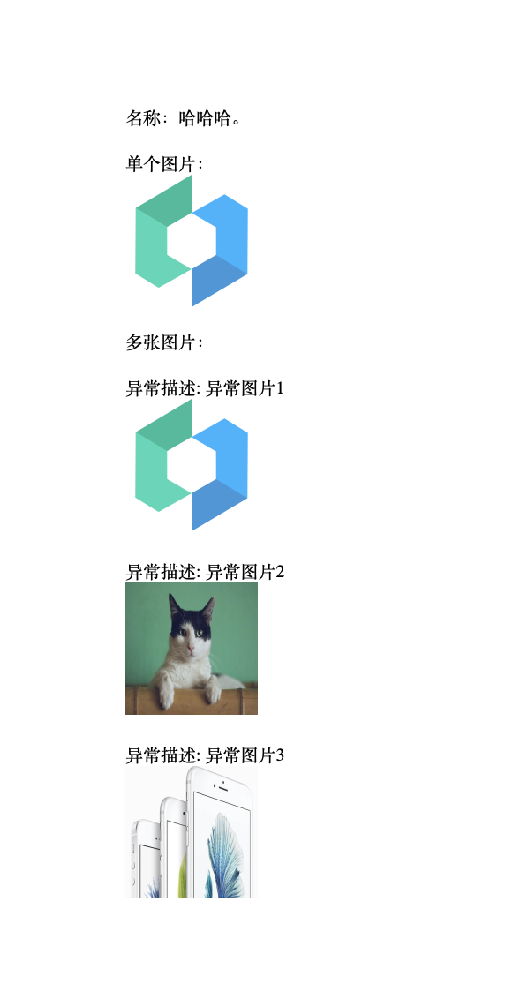

# 生成 docx

通过 `docx` 模板插入前端数据 `demo`

[x] 插入数据

[x] 插入图片数据

## 截图



## 调用示例

```ts
async function generateDocx() {
  loading.value = true;
  error.value = "";

  try {
    await createDoc({
      template: "/template.docx",
      fileName: "生成文档",
      imageSize: [100, 100],
      images: {
        image: "https://img.yzcdn.cn/vant/logo.png",
        images: [
          {
            url: "https://img.yzcdn.cn/vant/logo.png",
            description: "异常图片1",
          },
          {
            url: "https://img.yzcdn.cn/vant/cat.jpeg",
            description: "异常图片2",
          },
          {
            url: "https://img.yzcdn.cn/vant/apple-1.jpg",
            description: "异常图片3",
          },
        ],
      },
      form: {
        name: "哈哈哈",
      },
    });
  } catch (e) {
    error.value = e instanceof Error ? e.message : "生成文档失败";
  } finally {
    loading.value = false;
  }
}
```
